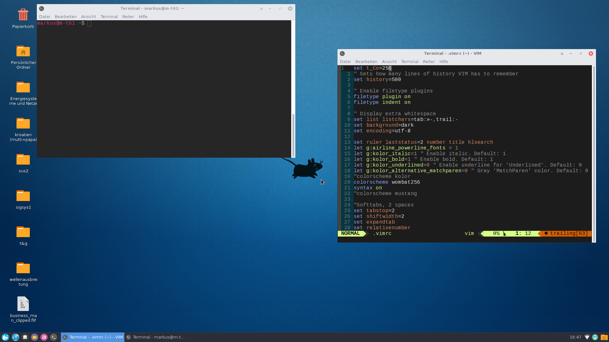

#dotfiles

This are not only my dotfiles. Its the setup i like to start with, when i install Linux on a new machine.

My favorit distribution is Antergos, with the xfce desktop. The goal of this project is, to be able to make a complete Setup with just one command, after installing Antergos with xfce desktop.

The screenshot below shows my desktop with zsh and vim started.

##Installation

To clone this repository into your home folder and start the setup script, run the following command

        cd ~/ && git clone https://github.com/mbader22/dotfiles.git && . ~/dotfiles/fullsetup.sh
